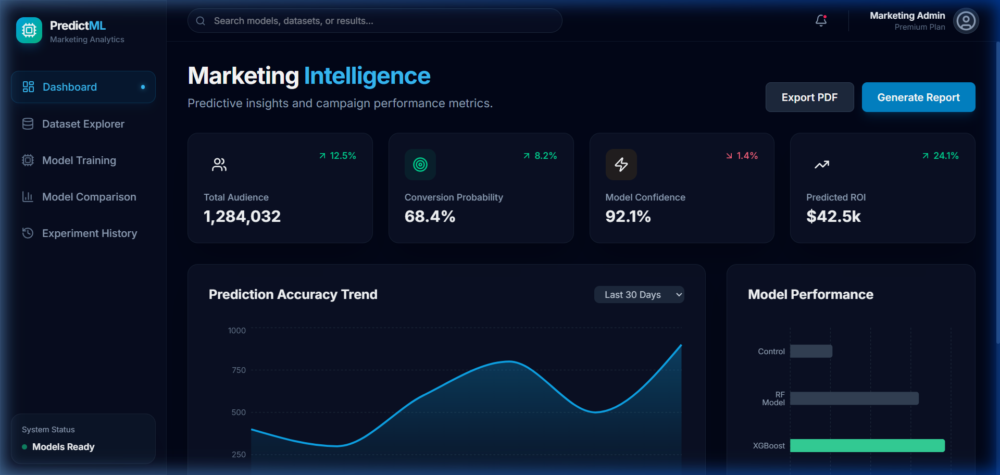
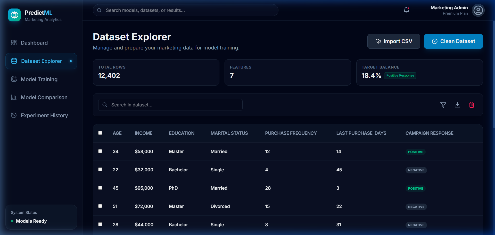
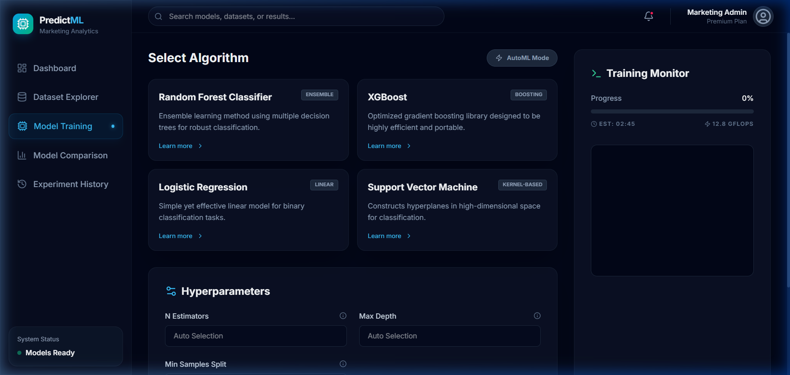
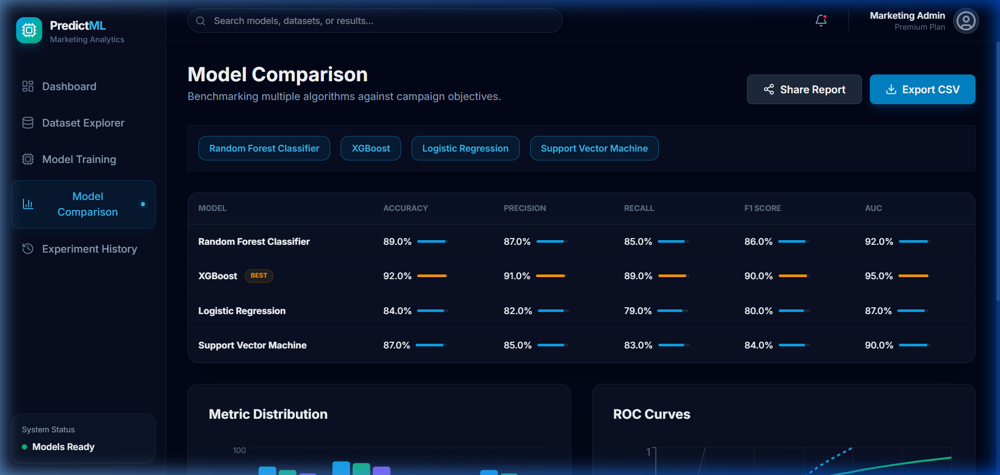
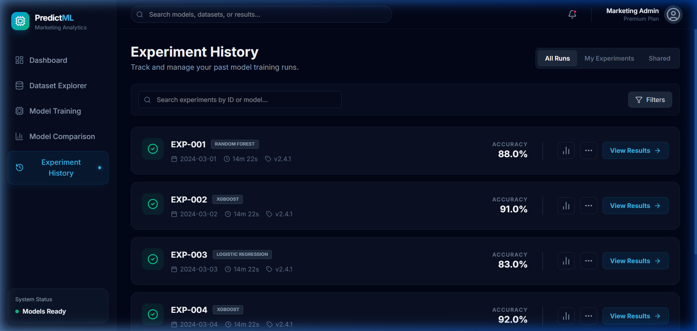

# PredictML - Marketing Analytics Dashboard

PredictML is a premium, responsive React-based dashboard designed for customer classification and marketing campaign analytics. It features a modern dark-mode aesthetic with glassmorphism effects and high-quality data visualizations to simulate a complete machine-learning workflow.

## 🚀 Key Features

- **Marketing Intelligence Dashboard**: High-level overview of campaign performance and conversion probabilities.
- **Dataset Explorer**: In-depth inspection of customer demographics and purchase history with simulated data-cleaning tools.
- **Model Training Center**: Select algorithms, configure hyperparameters, and monitor training progress in real-time.
- **Comparison Dashboard**: Side-by-side benchmarking of multiple models with ROC curves and metric distribution charts.
- **Experiment History**: Historical tracking of all model runs and versioning.

---

## 📸 Screenshots

### 1. Unified Dashboard
Comprehensive overview of marketing metrics and prediction trends.


### 2. Dataset Explorer
Interactive data table for customer profile inspection and preparation.


### 3. Model Training Center
Algorithm selection and real-time training monitor with log output.


### 4. Model Benchmarking
Multi-metric comparison of algorithm performances across different parameters.


### 5. Experiment Tracking
Timeline and historical data for all training experiments.


---

## 🛠️ Tech Stack

- **Framework**: [React 19+](https://react.dev/)
- **Build Tool**: [Vite 7+](https://vite.dev/)
- **Styling**: [Tailwind CSS v4](https://tailwindcss.com/) (Vite Plugin Mode)
- **Visualizations**: [Recharts](https://recharts.org/)
- **Animations**: [Framer Motion](https://www.framer.com/motion/)
- **Icons**: [Lucide React](https://lucide.dev/)

---

## 🚦 Getting Started

### Prerequisites
- Node.js (v18 or higher)
- npm or yarn

### Installation

1. Clone or navigate to the project directory:
   ```bash
   cd c:\Users\rayan\Desktop\ProjetML\Front
   ```

2. Install dependencies:
   ```bash
   npm install
   ```

3. Start the development server:
   ```bash
   npm run dev
   ```

The application will be available at `http://localhost:5173/`.

---

## 📂 Project Structure

- `src/pages`: Individual feature views (Dashboard, Training, etc.)
- `src/components`: Reusable UI elements and layout components.
- `src/utils/mockData.js`: Centralized data store for all simulations.
- `src/index.css`: Tailwind v4 theme configuration and global styles.

---

## 💡 Future Integration
The project uses a decoupled data layer (`mockData.js`). To integrate with a real backend, simply update the methods in the utility layer to fetch from your backend API endpoints.
